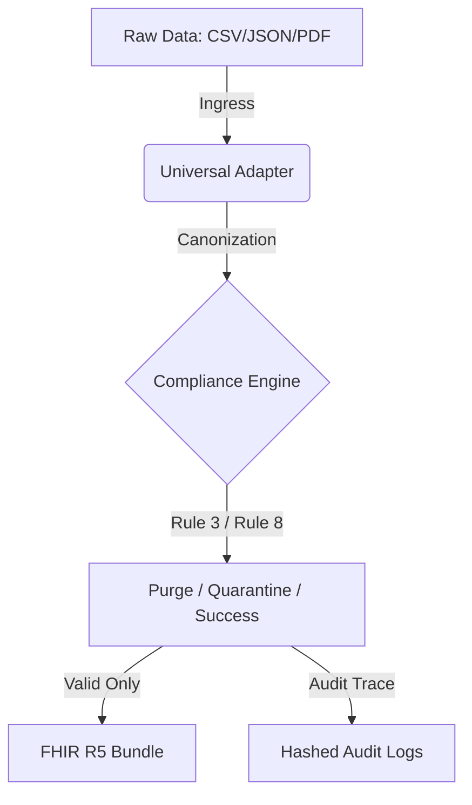

# 📔 Developer’s Field Guide: Phase 0.1 Scaffold

Welcome, future Senior Architect! This guide is your "secret map" to the OmniGest Phase 0.1 codebase. We will break down every line, every rule, and every jargon to make you a master of Indian Health-Tech compliance.

## 📌 Table of Contents
1. [The Mental Model: The Digital Gatekeeper](#the-mental-model-the-digital-gatekeeper)
2. [Jargon Buster: Health-Tech 101](#jargon-buster-health-tech-101)
3. [Architecture Map: The Data Journey](#architecture-map-the-data-journey)
4. [Line-by-Line: `compliance_engine.py`](#line-by-line-compliance_enginepy)
5. [Line-by-Line: `ingress.py`](#line-by-line-ingresspy)
6. [Scenario Analysis: Vikram vs. Priya](#scenario-analysis-vikram-vs-priya)
7. [2026 Compliance Cheat Sheet](#2026-compliance-cheat-sheet)

---

## 🏰 The Mental Model: The Digital Gatekeeper
Imagine a massive hospital. Every day, thousands of patients bring in their data on paper, USB drives, or apps. 

**The Scaffold is the "Digital Gatekeeper" at the hospital entrance.**
- It checks if the paperwork is valid (**Notice_ID Validation**).
- It asks if they want their data shared (**Consent Verification**).
- If a patient says "Stop sharing my data!", the Gatekeeper doesn't just throw away the folder; it burns the PII but keeps a small receipt saying, "Folder burned on this date" (**Hard-Purge / Rule 8**).

---

## 🗣️ Jargon Buster: Health-Tech 101

| Term | Simple Definition | Key Context |
| :--- | :--- | :--- |
| **PII Masking** | Hiding "Personally Identifiable Information" (like names/IDs). | *Example: "John Doe" becomes "REDACTED" or a secure hash.* |
| **FHIR R5** | A global "language" for healthcare data. | *R5 is the 2026 standard for modern medical apps.* |
| **Data Fiduciary** | Any entity (hospital/app) that handles patient data. | *The law makes you responsible for protecting this data.* |
| **Consent Artifact** | The digital "Contract" where a patient gives permission. | *Rule 8 allows patients to "cancel" this contract at any time.* |
| **ABHA ID** | Ayushman Bharat Health Account (India's unique health ID). | *The "Universal Key" for healthcare in India.* |

---

## 🗺️ Architecture Map: The Data Journey

1.  **Ingress (ingress.py)**: The "In-box" where raw files land.
2.  **Canonization**: Turning messy hospital names into clean labels (e.g. `patient_name` -> `Patient_Name`).
3.  **Compliance Engine**: The "Brain" that decides who gets in and who gets kicked out.
4.  **FHIR R5 Output**: Delivering the clean data in the latest global standard format.

---
---

## 🔍 Line-by-Line: `compliance_engine.py`
This is the "Brain" of the operation. It decides the fate of every record based on the law.

| Line | Code Snippet | What it does | 🛡️ 2026 Compliance |
| :--- | :--- | :--- | :--- |
| 11-14 | `self.threshold_date = ...` | Sets a 365-day cutoff and defines the strict **2026 Notice ID** format. | **DPDP Rule 3**: Data should not be kept longer than necessary for the purpose. |
| 16-20 | `def validate_notice_id(...)` | Uses **Regex** to ensure the document ID follows the `N-2026-TYPE-v1.1` pattern. | **ABDM 2.0 Docs**: Ensuring legal documentation is valid and version-tracked. |
| 22-26 | `def hash_id(...)` | Turns a raw ABHA ID into a scrambled hash (e.g., `a7b2c9d1****`). | **DPDP Rule 8**: Protects PII while allowing a "Traceable Audit Line" for auditors. |
| 45-52 | `if consent == 'REVOKED': ...` | The "Kill-Switch". Instantly flags records where consent is cancelled or staled. | **Rule 7 & 8**: Right to Withdraw Consent & Right to be Forgotten. |
| 62-73 | `def apply_purge(...)` | The **Hard-Purge**. Physically overwrites data with "REDACTED" labels. | **Rule 8 Hard-Purge**: Ensuring data is permanently erased from memory. |

---

## 🔍 Line-by-Line: `ingress.py`
This is the "Assembly Line" that loads and cleans the data using high-speed tools.

| Line | Code Snippet | What it does | 🛡️ 2026 Compliance |
| :--- | :--- | :--- | :--- |
| 6-25 | `def detect_format(...)` | Identifies the file type (CSV, FHIR, etc.) to apply the correct parsing rules. | **ABDM M1**: Cross-format compatibility for the Indian health ecosystem. |
| 41-60 | `lf = pl.scan_csv(...)` | Uses **Polars Lazy API** to process millions of rows without crashing the system. | **Optimization**: Production-grade speed for Phase 0.2 API traffic. |
| 65-78 | `column_mapping = {...}` | Standardizes "Messy" columns (like `ID_ABHA`) into the "Canonical" `ABHA_ID`. | **Data Integrity**: Ensuring the right person is linked to the right record. |
| 99-115 | `.with_columns([...])` | The **Logic Pipeline**. Automatically tags every row as PROCESSED, PURGED, or QUARANTINED. | **DPDP Automation**: Reducing human error in legal data handling. |
| 134-168 | `def run_audit(...)` | Generates the **Compliance Dashboard** to prove to the government that rules were followed. | **Rule 7 Accountability**: Providing transparent proof of data processing. |

---

## 🧪 Scenario Analysis: Vikram vs. Priya

Let's see the code in action with two simulation patients:

### Scenario 1: Vikram M. (Status: PURGED)
- **Data**: `Consent_Status = 'REVOKED'`, `Notice_Date = '2023-01-01'`.
- **Reasoning**: Even though Vikram is a long-term patient, our `evaluate_record` function (Line 45 in `compliance_engine.py`) sees the 'REVOKED' flag. 
- **Code Action**: The `apply_purge` function kicks in. Vikram's name becomes **REDACTED**, and his clinical data is wiped. 
- **2026 Result**: Vikram's privacy is protected. He has exercised his **"Right to Erasure" (Rule 8)**.

### Scenario 2: Priya L. (Status: QUARANTINED)
- **Data**: `ABHA_ID = None`, `Consent_Status = 'ACTIVE'`.
- **Reasoning**: Priya gave consent, but her identity is missing. Our `ingress.py` logic (Line 110) sees the `null` ABHA ID.
- **Code Action**: The record is moved to **QUARANTINED**. It won't hit the main logs, but it's kept in a "Waiting Room" for correction.
- **2026 Result**: Satisfies **ABDM Milestone 1 (M1)** requiring valid health identifiers before data linking.

---

## 🏁 Phase 0.1 Summary: The Success Criteria
To pass a real-world audit, your scaffold must prove:
1. **Notice Validity**: Rejected any IDs not matching the 2026 versioning regex.
2. **Hard-Purge Proof**: No plain-text names of revoked patients exist in any log.
3. **Traceability**: A secure hash remains to prove *why* a record was purged without revealing *who* it was.

---
*Created by Antigravity AI | Mentoring the next generation of ABDM Architects*
